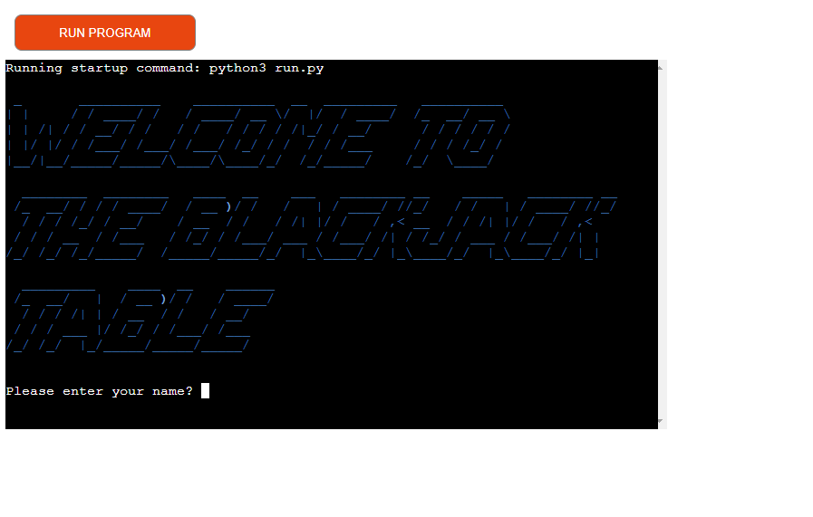

# BlackJack
This is a command line BlackJack game I created for my Portfolio Project 3 in Python and is played in a terminal hosted on Heroku.
This game is played by you the player against the dealer which is the computer. In this Game you try to get 21 or closer to 21 than the dealer.
  
  

 [Click Here To Visit Live Site](https://blackjack-10.herokuapp.com/)  
- - -  

## Table of Contents
1. [How to play](#how-to-play)
2. [Features](#features)
3. [Demo](#Demo)
4. [Future Features](#future-features)
5. [Technologies Used](#technologies-used)
6. [Testing](#testing)
7. [Bugs](#bugs)
8. [Deployment](#deployment)
9. [Credits](#credits)
10. [Acknowledgements](#acknowledgements)

## How to play:
The aim of BlackJack is to get 21 also know as BlackJack or as close as possible without busting(busting is when you go above 21). If you go
bust the dealer automatically wins. If you have 21 or are closer to 21 than the dealer then you win. If the dealer lands on 17 or more they must 
stand which means to stay and not take another card. If the dealer is below 17 they must hit, this means they have to take another card.
If the dealer busts and you do not then you wint the hand.

## Features:  

### Welcome Screen
- When the user starts the game they are greeted with large text that says **Welecome to the BlackJack Table**.
- To get the below effect I used the pyfiglet module and set the font equal to **slant** and the color to blue.  
- The below this it will ask the user to enter their name.

## Demo:

## Future Features:

## Technologies Used:
- Python was used to code the game.
- [Gitpod](https://www.gitpod.io/about) was used to create this app and then push everything to github.
- [Visual Studio Code](https://en.wikipedia.org/wiki/Visual_Studio_Code) was used to work on the app locally.
- [PyCharm](https://www.jetbrains.com/lp/pycharm-anaconda/) was also used to work on the app locally.
- [Github](https://en.wikipedia.org/wiki/GitHub) is used to store the repository.
- [Heroku](https://en.wikipedia.org/wiki/Heroku) is used to deploy the app.

## Testing:

## Bugs:

## Deployment:
This game was deployed on Heroku. The following steps were used to deploy the game to Heroku.
- First make sure you are signed into Heroku.
- Then on the main dashboard select **New** and then choose **Create new app** from the drop down menu.
- Then you will need to choose a name for your project(this name has to be unique to Heroku) and also choose the region, based on where you are located(as I'm in Europe so I chose Europe)
and then click on **Create app**.
- Then go to the **Settings** tab.
- In **Settings** click on **Reveal Config Vars** and enter the following key **Port** with the Value of **8000**.
- If you are using a Google sheets API in your project you will need to enter **Creds** as another **Config Var**.
- Next scroll down to **Buildpacks** and click **Add buildpack** choose **Python** and then click **Save changes**.
- Repeat the above step and select **nodejs** and click **Save changes**.
- Next go to the **Deploy tab**.
- Under **Deployment method** choose Github and then click **Connect to GitHub** you will be probably be prompted to sign into your Github.
- Then you can search for you GitHub repository, in my case this was **blackjack** and click **connect**.
- To deploy automatically you will need to select **Enable Automatic Deploys** which will rebuild the app everytime you push a change to GitHub.
- To deploy manually go to the **Manual deploy** section below and click **Deploy Branch**. Just remember you will need to do this everytime you make a change to your
code on Github.
- Below you will see **your app was sucessfully deployed** with a **view** button below this that will take you to the url of you deployed app.

## Credits:
- Code Coach's video on YouTube showed me how to declare the deck and create the deal card function, it also helped me on how to structure the game.The Youtube video can be found [here](https://www.youtube.com/watch?v=mpL0Y01v6tY).
- Aphrx quick video on YouTube show me how I could structure the game differently if i had used classes, this would be super helpful to anyone who is interested in creating blackjack game. the video can be found [here](https://www.youtube.com/watch?v=C82s5WufNUA).
- Stack overflow was used to make the large welcome and goodbye text using pyfiglet and rich. The code snipit can be found [here](https://stackoverflow.com/questions/67474578/making-coloured-ascii-text-with-python).
- Stack over flow was used to get the typewrite effect. A variation of the code snipit can be found [here](https://stackoverflow.com/questions/19911346/create-a-typewriter-effect-animation-for-strings-in-python)

## Acknowledgements:
- I would like to thank my mentor Adegbenga Adeye for all help throughout the project and for being really positive about the course.
- I would like to thank Code Institutes Slack Communtiy as this helped me so much when I got stuck on part of my project and also with course challenges.
- I would also like to thank our chort facilitators Kenan Wright and Kasia Bogucka, for answering any course related questions I asked and for porviding us with a weekly study schedule.