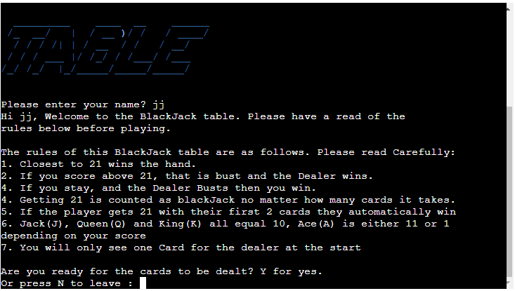
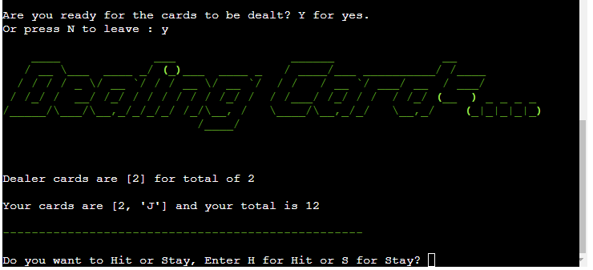

# BlackJack
This is a command line BlackJack game I created for my Portfolio Project 3 in Python and is played in a terminal hosted on Heroku.
This game is played by you the player against the dealer which is the computer. In this game you try to get 21 or closer to 21 than the dealer.
  
  

 [Click Here To Visit Live Site](https://blackjack-10.herokuapp.com/)  
- - -  

## Table of Contents
1. [Flow Chart](#Flow-Chart)
2. [How to play](#how-to-play)
3. [Features](#features)
4. [Future Features](#future-features)
5. [Technologies Used](#technologies-used)
6. [Testing](#testing)
7. [Bugs](#bugs)
8. [Deployment](#deployment)
9. [Credits](#credits)
10. [Acknowledgements](#acknowledgements)

## Flow Chart

 

## How to play:
The aim of BlackJack is to get 21 also know as BlackJack or as close as possible without going bust(bust is when you go above 21). If you go
bust the dealer automatically wins. If you have 21 or are closer to 21 than the dealer then you win. If the dealer lands on 17 or more they must 
stand which means to stay and not take another card. If the dealer is below 17 they must hit, this means they have to take another card.
If the dealer busts and you do not then you win the hand.

## Features:

### Welcome Screen
- When the user starts the game they are greeted with large text that says **Welcome to the BlackJack Table**.
- To get the below effect I used the pyfiglet module and set the font equal to **slant** and the color to blue.  
- Then below this it will ask the user to enter their name.  

  

### Rules section
- After the user enters their name they will see a greeting message with their name and tell them to read the rules this will be printed out like a typewriter.
- Then the user will seee all the rules of this BlackJack table, these will aslo be printed out like a typewriter.
- Below the rules they will be asked if they are ready for the cards to be dealt. If they want to play and are ready the user can type **Y**. If they
do not wish to play and want to leave they can type **N** to leave.    

### Dealing the cards
- If the user decides to play then the cards will be dealt, the dealers will be dealt first followed by the players.
- Only one card will be dealt for the dealer, as in casino you will only see one card for the dealer as the other one woudl be face down.
- If the player does not have a blackJack(21) the they will be asked if they want to Hit or Stay.

### Winning Screen
- If the user decides to Hit and his cards are then above 21 know as bust, then it will show that the dealer won as the player has bust.
- If the player is still below 21 after having a third card dealt then it will ask them if they wish to receive another card and will continute to do
so until they stay or bust.
- If the player wins the hand then the winner message is in green(first screenshot below), but if the dealer wins the winning message is displyed in red(second screenshot below). Both the players and computers score is displayed in blue beneath.

  

  

### End the Game
- If the users want to play another game they can type **Y** and the cards for another round will be dealt.
- If the users decides they have had enough and want to leave the game they can type **N** and they will be greeted with the text **GoodBye....**. This text will be displayed using
the pyfiglet module and with the **slant** font and in the color yellow as can be seen in the below screenshot.
  
    

## Future Features:
- In the future I would like to add a betting system so that a player could bet like a real BlackJack table. With this implemented the player 
could choose how much money they want to start with from a list before each hand is dealt. They could could also choose how much they want to bet
and if they win they take one and half times that from the dealer like in real BlackJack and if they lose they just lose their bet.
- I would also like to make it multiple player, like you have at a BlackJack table and everyone is betting against the dealer.(although this may be tricky to implement).

## Technologies Used:
- [Lucidchart](https://www.lucidchart.com/pages/) was used to design the flow chart.
- [Python](https://en.wikipedia.org/wiki/Python_(programming_language)) was used to code the game.
- [Gitpod](https://www.gitpod.io/about) was used to create this app and then push everything to github.
- [Visual Studio Code](https://en.wikipedia.org/wiki/Visual_Studio_Code) was used to work on the app locally.
- [PyCharm](https://www.jetbrains.com/lp/pycharm-anaconda/) was also used to work on the app locally.
- [Github](https://en.wikipedia.org/wiki/GitHub) is used to store the repository.
- [Heroku](https://en.wikipedia.org/wiki/Heroku) is used to deploy the app.

## Testing:

### Manual Testing

| Feature | Test Performed | Expected Outcome | Result |
|---------|----------------|------------------|--------|
| Input Name | Enter blank spaces | Print error message and ask user to enter name again | Pass |
|            | Enter Name or letters | Welcome the user and print out the rules of the game | Pass |
  

 
| Feature | Test Performed | Expected Outcome | Result |
|---------|----------------|------------------|--------| 
| Ask user if they are ready for the cards to be dealt| Enter random letters | Print error message and ask the user again| Pass |
|    | Entered **y** for yes | Deal the cards | Pass |
|    | Entered **n** for no | Print goodbye and exit | Pass |  
  

| Feature | Test Performed | Expected Outcome | Result |
|---------|----------------|------------------|--------|
| Check if card values are correct | Played 30 hands | Cards should total the correct amount | Pass |
|            | Make sure face cards have the correct value| Jack, Queen, king should be equal to 10 and Ace should be equal to 11 or 1 depending on the hand | Pass |
  

| Feature | Test Performed | Expected Outcome | Result |
|---------|----------------|------------------|--------|
| If users score is less than 21 ask if they want to Hit or Stay | Entered random word | Prompt the user if they want to hit or stay again | Pass |
|            | Entered **s** for stay | No extra card was dealt and the winner was computed | Pass |
|            | Entered **h** for hit | No extra card was dealt and the winner was computed | Pass |
  

| Feature | Test Performed | Expected Outcome | Result |
|---------|----------------|------------------|--------|
| Compute the winner | Won multiple hands | Expected to see a winning message and both the player and dealer totals | Pass |
|            | Lost multiple hands | Expected to see a loser message and both the player and dealer totals | Pass |

  

| Feature | Test Performed | Expected Outcome | Result |
|---------|----------------|------------------|--------|
| Ask if the user wants to play anther hand | Enter random letters | Print error message and ask the user again | Pass |
|            | Entered **y** for yes | Deal cards for another hand | Pass |
|            | Entered **n** for no | Print goodbye and exit | Pass |

- I also tested the game in the Gitpod terminal and locally on VS Code terminal and everything worked as expected.

### Validator Testing
- I tested the app using the PEP8 validator in gitpod, this I had to install by running **pip3 install pycodestyle** then searching for **Python: Select Linter**
and selecting **pycodestyle**. The PEP8 erorrs would then be underlined in red and also listed in **Problems tab**
- As you can see from the below screenshot there is no errors. The 3 warnings below come with the code intitute template that I used and this does not affect anything.
  

- I also test the site on Pythonchecker.com which is a Python PEP8 sytax checker and it return 100% with no errors. The site can be found [here](https://www.pythonchecker.com/)
  
  

## Bugs and Issues
- After creating the project I was getting alot of PEP8 errors in, most of which were for **lines too long** as you can see in the below screenshot.
- To fix this and conform to PEP8 standards I broke the lines up and made sure they did not go past 79 characters. 
- On of the biggest issues I had with this project was getting to ace to be either 11 or 1 depending on you total score, each time I though I had figured it out,
I would soon realise in testing that it was not correct. After doing alot of research online I read a comment that said it is better to set the ace to always be 1 and
 then check if the total value is less than 11, if so add 10.

 

## Deployment:
This game was deployed on Heroku. The following steps were used to deploy the game to Heroku.
- First make sure you are signed into Heroku.
- Then on the main dashboard select **New** and then choose **Create new app** from the drop down menu.
- Then you will need to choose a name for your project(this name has to be unique to Heroku) and also choose the region, based on where you are located(as I'm in Europe so I chose Europe)
and then click on **Create app**.
- Then go to the **Settings** tab.
- In **Settings** click on **Reveal Config Vars** and enter the following key **Port** with the Value of **8000**.
- If you are using a Google sheets API in your project you will need to enter **Creds** as another **Config Var**.
- Next scroll down to **Buildpacks** and click **Add buildpack** choose **Python** and then click **Save changes**.
- Repeat the above step and select **nodejs** and click **Save changes**.
- Next go to the **Deploy tab**.
- Under **Deployment method** choose Github and then click **Connect to GitHub** you will probably be prompted to sign into your Github.
- Then you can search for you GitHub repository, in my case this was **blackjack** and click **connect**.
- To deploy automatically you will need to select **Enable Automatic Deploys** which will rebuild the app everytime you push a change to GitHub.
- To deploy manually go to the **Manual deploy** section below and click **Deploy Branch**. Just remember you will need to do this everytime you make a change to your
code on Github.
- Below you will see **your app was sucessfully deployed** with a **view** button below this that will take you to the url of your deployed app.

## Credits:
- Code Coach's video on YouTube showed me how to declare the deck and create the deal card function and how to calculate the winner, it also helped me on how to structure the game. The Youtube video can be found [here](https://www.youtube.com/watch?v=mpL0Y01v6tY).
- Aphrx quick video on YouTube show me how I could structure the game differently if i had used classes, this would be super helpful to anyone who is interested in creating blackjack game. The video can be found [here](https://www.youtube.com/watch?v=C82s5WufNUA).
- Stack overflow was used to make the large welcome and goodbye text using pyfiglet and rich. The code snipit can be found [here](https://stackoverflow.com/questions/67474578/making-coloured-ascii-text-with-python).
- Stack over flow was used to get the typewrite effect. A variation of the code snipit can be found [here](https://stackoverflow.com/questions/19911346/create-a-typewriter-effect-animation-for-strings-in-python)
- A comment on reddit learn python thread helped me to understand how to set the ace value to either 1 or 11. The sub can be found [here](https://www.reddit.com/r/learnpython/).

## Acknowledgements:
- I would like to thank my mentor Adegbenga Adeye for all help throughout the project and for being really positive about the course.
- I would like to thank Code Institutes Slack Communtiy as this helped me so much when I got stuck on part of my project and also with course challenges.
- I would also like to thank our chort facilitators Kenan Wright and Kasia Bogucka, for answering any course related questions I asked and for porviding us with a weekly study schedule.